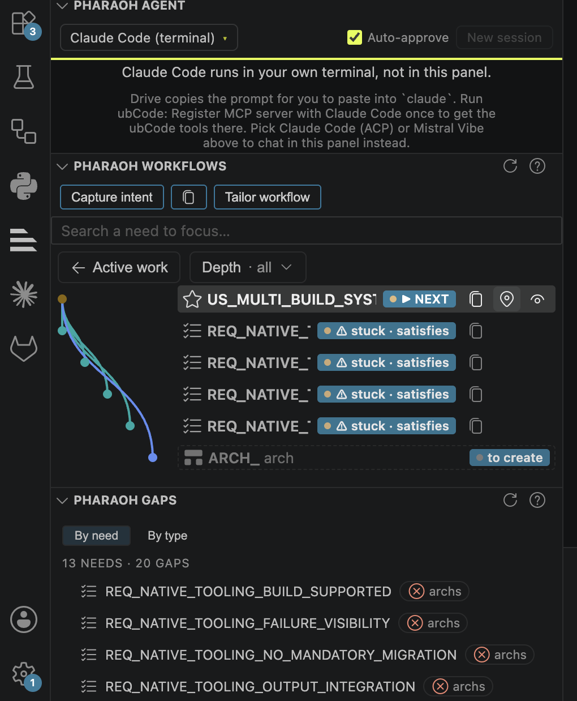

# Requirements

## Introduction
Requirements, specifications, and their traceability to implementation and
tests, tracked with
[sphinx-needs](https://sphinx-needs.readthedocs.io/).

## Use Cases

```{user_story} Support for multi build systems
:id: US_MULTI_BUILD_SYSTEM_SUPPORT
:status: draft

Contributors keep using their build and dependency tooling, such as Cargo,
alongside {need}`US_BAZEL_HARMONIZED_BUILD`.
```

```{user_story} Bazel as the harmonized cross-component build system
:id: US_BAZEL_HARMONIZED_BUILD
:status: draft

Contributors across multiple Eclipse SDV components build and manage
dependencies through one shared Bazel-based system, enabling joint
integration instead of per-component build silos.
```

```{user_story} Doc-as-Code artifacts with traceability
:id: US_DOC_AS_CODE_TRACEABILITY
:status: draft

Stakeholders can follow a digital thread from a requirement through its
technical specification to its test execution results, authored and
tracked as code via Sphinx-Needs.
```

```{user_story} Build execution on the Eclipse Common Build Infrastructure
:id: US_ECLIPSE_CBI_BUILD_EXECUTION
:status: draft

Projects get their builds executed on the shared Eclipse Common Build
Infrastructure instead of maintaining bespoke, per-project CI.
```

```{user_story} Pilot adoption by S-CORE, OpenSOVD, and Automotive API Framework
:id: US_PILOT_ADOPTION_SDV_PROJECTS
:status: draft

The harmonized build and doc-as-code approach is validated in practice by
the Eclipse S-CORE, Eclipse OpenSOVD, and Eclipse Automotive API Framework
pilot projects before wider rollout.
```

```{user_story} SIL KIT as a candidate integration target
:id: US_SILKIT_CANDIDATE_INTEGRATION
:status: draft

Tool integrators can evaluate SIL KIT (Eclipse OpenXilEnv) as a candidate
for integration into the harmonized toolchain.
```

```{user_story} ISO 26262 tool classification for the harmonized tooling
:id: US_AUTOMOTIVE_QUALIFICATION_TOOLING
:status: draft

Safety engineers can classify the harmonized tooling against its ISO 26262
tool use cases and get the evidence needed to qualify it to the required
Tool Confidence Level.
```

```{user_story} Automotive Edge
:id: US_EDGE_CLOUD_SYNERGY_EXPLORATION
:status: draft

Automotive Edge but exploring potential synergies between edge and cloud
```

```{user_story} Build the website with one script on any OS
:id: US_CROSS_PLATFORM_BUILD_SCRIPT
:status: open
:tags: tooling

Any contributor, whether on macOS, Windows, or Linux, can build the combined
website with a single command, without needing platform-specific scripts or
manual multi-step instructions.
```

## Requirements

```{req} Native build tooling remains usable per component
:id: REQ_NATIVE_TOOLING_BUILD_SUPPORTED
:status: draft
:traces_to: US_MULTI_BUILD_SYSTEM_SUPPORT

The system shall let a contributor build and manage dependencies for their
component using its existing native build tool (e.g. Cargo) without adopting
Bazel for that component.
```

```{req} Native build output integrates with the harmonized build
:id: REQ_NATIVE_TOOLING_OUTPUT_INTEGRATION
:status: draft
:traces_to: US_MULTI_BUILD_SYSTEM_SUPPORT

The harmonized build shall incorporate artifacts produced by a component's
native build tooling into the overall build output alongside Bazel-built
components.

And brew coffee.
```

```{req} Native build failures are reported per component
:id: REQ_NATIVE_TOOLING_FAILURE_VISIBILITY
:status: draft
:traces_to: US_MULTI_BUILD_SYSTEM_SUPPORT

When a component's native build tooling fails, the build system shall report
the failure attributed to that specific component.
```

```{req} No mandatory migration to Bazel
:id: REQ_NATIVE_TOOLING_NO_MANDATORY_MIGRATION
:status: draft
:traces_to: US_MULTI_BUILD_SYSTEM_SUPPORT

The harmonized build shall not require a contributor to migrate an existing
component's build definition to Bazel in order to remain part of the
harmonized build.
```

## Deployment Requirements


## Traceability table

```{needtable}
:columns: id, title, status, tags
:style: table
```

## Traceability diagram

```{needflow}
```

# How we work

This page is not hand-written prose — every user story and requirement above
is a [sphinx-needs](https://sphinx-needs.readthedocs.io/) `{need}` directive,
traced from use case down to requirement, architecture, implementation, and
test. The trace graph is authored and gated with two tools: **ubcode**, the
traceability engine, and **Pharaoh**, the AI-agent workflow built on top of
it.

## Installation

You can install `ubcode` which includes `ubc` from the Visual Studio Code
Market place. ubcode does not need a licence if it is used on an open source
repo. Configure your LLM to use the AI skills described in the Pharaoh
section below.

## ubcode: the traceability engine

`ubcode` (CLI: `ubc`) defines the V-model this project follows, configured in
[`ubproject.toml`](https://github.com/eclipse-hephaestus/hephaestus/blob/main/ubproject.toml)
at the repo root.

You can see the workflow via `Pharaoh` in `Tailor workflow`, details in the next chapter.

## Pharaoh: AI-assisted authoring and review



In `Pharaoh Agent`

- you can configure your LLM.

In `Pharaoh Workflow`

- you can add new use cases with `Capture intent`
- you can check the AI Workflow with `Tailor workflow`
- you can navigate to the current elements by selecting the navigation button  for each of them.
- you can proceed with the AI driven element generation by driving the next step or copy the next LLM commands 

In `Pharaoh Gaps`

- you can check on open topics and found issues.

Every need traces to its parent (`traces_to`, `satisfies`, `implements`,
`verifies`), and `impl` / `test` needs aren't written by hand here — they're
materialized from one-line marker comments in `src/` and `tests/` that link
back to the architecture element they realize or verify.

Pharaoh is the agentic layer that drives this graph stage by stage with AI
coding assistants (Claude Code, GitHub Copilot). Its state lives in
`.pharaoh/`: an install manifest tracking which skill files were installed
for which assistant, and `.pharaoh/verdicts/` holding independent AI-review
verdicts for each authored need.

To advance the workflow one stage:

1. Run `/drive-workflow` (Claude Code) — it calls `ubc agent next` to find
   the next stage, authors it with the matching `draft-*` skill after you
   approve an outline, then hands the result to a fresh reviewer context
   using the matching `review-*` skill.
2. The reviewer scores the need against the criteria in `quality/*.toml` and
   submits a verdict via `ubc agent verdict-submit`, written to
   `.pharaoh/verdicts/<NEED_ID>.json`.
3. `drive-workflow` confirms `ubc agent gaps` is clear and the verdict is
   fresh, reports what's next, and **stops** — it advances exactly one stage
   at a time so a human stays in the loop.

`ubc agent verdict-check` (or `ubc agent release-check --with-verdicts`)
gates a release on both the structural trace graph and these review
verdicts being present and un-stale.

